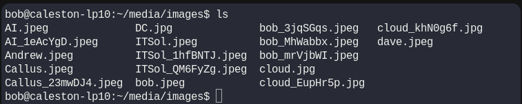
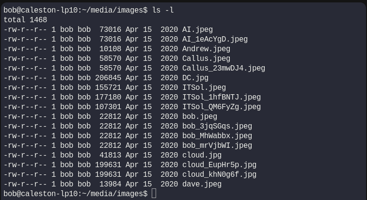
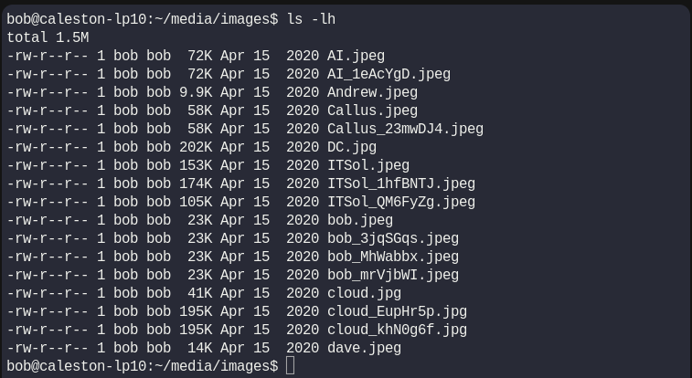
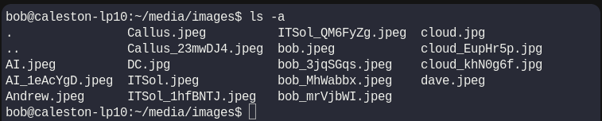
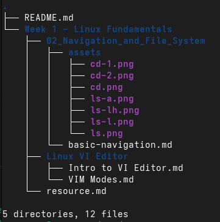

# Basic Navigation Commands (pwd, ls, cd)

## 🧭 Welcome Linux explorers! 🐧

> If you’re just getting started with Linux, the terminal might seem a little frightening at first.
But trust me - once you learn a few simple commands, you’ll be moving around your system like a pro! 🚀

## 1. `pwd` - <u>P</u>rint <u>W</u>orking <u>D</u>irectory

The `pwd` command tells you exactly where you are in the file system.
> 💡 If you ever get “lost” in the terminal, `pwd` will show you your current location.

```bash
pwd
```
Output:
```bash
/home/bob/media/images
```

## 2. `ls` - <u>L</u>i<u>s</u>t Directory Contents

The `ls` command shows you what’s inside the current folder.

```bash
ls
```
Output:<br>


> 💡 <b>Tip: `ls` have more useful 🚩flags</b>

* <b>Long listing format (permissions, size, date)</b>
```bash 
ls -l
```
Output:


> <b>Structure</b><br>
| Permissions | Number of hard links | Owner | Group | Size | last Modified Date | File/Directory Name |
* <b>Long format + human-readable sizes</b>
```bash
ls -lh
```
Output:


* <b>Show all files, including hidden ones</b>
```bash
ls -a
```
Output:


You can see there are special directories named as `.` and `..` . I will talk about in next section.

## 3. `cd` - <u>C</u>hange <u>D</u>irectory

The `cd` command lets you move between directories.

```bash
cd [directory name]
```
Example:
You can use this if this directory is in current directory.
```bash
cd media
```
Output:


Example:
Also you can use Absolute path to the directory to change directory.
```bash
cd /home/bob/media/
```


> 🚨 <b>Remember:</b>
Linux is case-sensitive - `media` and `Media` are not the same directory.

> 💡 <b>Tip:</b> linux have special characters to navigate between the system.<br>

<table>
    <tr>
        <th>character</th>
        <th>Path</th>
    </tr>
    <tr>
        <td> . </td>
        <td> Current Directory</td>
    </tr>
    <tr>    
        <td> .. </td>
        <td> Parent Directory</td>
    </tr>
    <tr>
        <td> ~ </td>
        <td> Home Directory [/home/bob]</td>
    </tr>
    <tr>
        <td> / </td>
        <td> Root Directory </td>
    </tr>
</table>

> 💡 <b>Tip:</b> If you type `cd` and hit `Enter`, then change directory to your `Home` Directory.<br>


## 🎁 Bonus : `tree` - View Files in a Tree Structure

While `pwd`, `ls`, and `cd` are the essentials for navigation, the `tree` command offers a more visual way to explore directories.<br>
It shows directories and files in a hierarchical structure.

### 🤔 Is `tree` Built-in?

No - most Linux distributions don’t include it by default.<br>
You need to install it:<br>

* <b>Debian/Ubuntu:</b>
```bash
sudo apt install tree
```
* <b>Fedora/RHEL/CentOS:</b>
```bash
sudo dnf install tree
```

### Basic Usage:
```bash
tree
```

Output:<br>


<b>Useful Options: </b>
<table>
    <tr>
        <td> tree -L 1 </td>
        <td> Limit depth to 1 level.</td>
    </tr>
    <tr>    
        <td> tree -a </td>
        <td> Show hidden files.</td>
    </tr>
    <tr>
        <td> tree -h </td>
        <td> Show file sizes in human-readable format.</td>
    </tr>
</table>

#### 🐧 So, we are in end of this navigation Guide, and My Last Tip is refer the manual of these commands to find more useful flags that will help you more to explore the linux file system.

#### 🔍 Where is the manual?
```bash
man [command]
```
Example:
```bash
man ls
```


