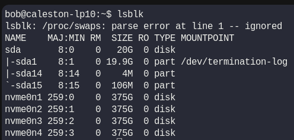

# Week 1 Progress

# Linux Administration Labs
## Linux Core Concept 1

1. Print Kernal Release
```bash
uname -r
```


```bash 
5.15.0-1083-gcp
```

2. Kernal Version - First number of the Kernal Release [5]

3. Kernal Major Version Number - second digit after the kernel version separated by a dot(.) [15]

4. The command dmesg is used to print the messages generated by the kernel. These messages include system boot information, hardware detection, driver messages, and other kernel-related logs. It's very useful for troubleshooting hardware or driver issues
```bash
dmesg
```
5. List information about block devices.
```bash
lsblk
```

Results : 5 Block Devices [sda, nvme0n1, nvme0n2, nvme0n3, nvme0n4]


### Lab End


