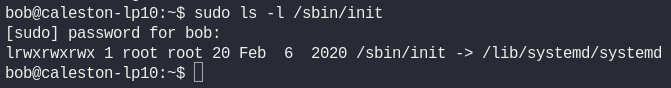
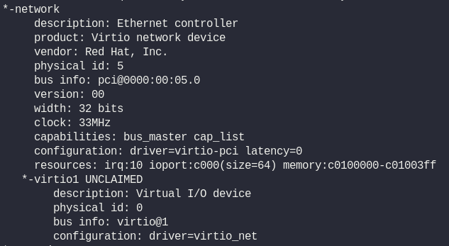

# Week 1 Progress

# Linux Administration Labs
## Linux Core Concept 2

<b>
1. Find the init process of the System
</b>

```bash
sudo ls -l /sbin/init
```

init process is the first process that starts when system boots up. In this case, the command sudo ls -l /sbin/init shows that /sbin/init is a symbolic link pointing to /lib/systemd/systemd.

This means your system uses systemd as its init system, which manages system startup, services, and daemons.

<b>
2. What is the default systemd target set in this system?
</b>

```bash
sudo systemctl get-default
```

systemctl is the command-line tool to control and manage the systemd system and service manager. Here are some common usages:

* Start a service:
```bash
  sudo systemctl start <service_name>
```
* Stop a service:
```bash
  sudo systemctl stop <service_name>
```
* Enable a service at boot:
```bash
  sudo systemctl enable <service_name>
```
* Disable a service at boot:
```bash
  sudo systemctl disable <service_name>
```
* Check the status of a service:
```bash
  systemctl status <service_name>
```
* Reboot or shutdown:
```bash
  sudo systemctl reboot
  sudo systemctl poweroff
```
* Set the default target (like runlevel):
```bash
  sudo systemctl set-default <target>
```
* Get the current default target:
```bash
  sudo systemctl get-default
```
<b>
3. Change the target to multi-user.target
</b>

```bash
sudo systemctl set-default multi-user.target
```

<b>
4. What type of file is firefox.deb located at /root?</b>

```bash
sudo file /root/firefox.deb
```

The file command is used to determine the type of a file. It examines the file's content and metadata to identify whether it's a text file, binary, image, archive, or specific format like a Debian package.

<b>
5. What type of file is sample_script.sh located at /root?</b>

```bash
sudo file /root/sample_script.sh
```


<b>
6. You are asked to install a new third-party IDE (integrated development environment ) in the system.

Which directory is the recommended choice for the installation?
</b>

Third-party software is usually installed under /opt

<b>
7. Which directory contains the files related to the block devices that can be seen when running the lsblk command?
</b>

```bash
lsblk
```
The directory containing files related to block devices visible with lsblk is /dev.

These files are device nodes representing hardware devices like disks and partitions.

<b>
8. What is the name of the vendor for the Ethernet Controller used in this system?
</b>

```bash
lshw
```

<b>lshw</b> is a powerful command-line tool used to display detailed information about the hardware configuration of your system. It shows info like CPU, memory, storage, network interfaces, and more—great for troubleshooting or inventorying hardware! 

### Lab End
